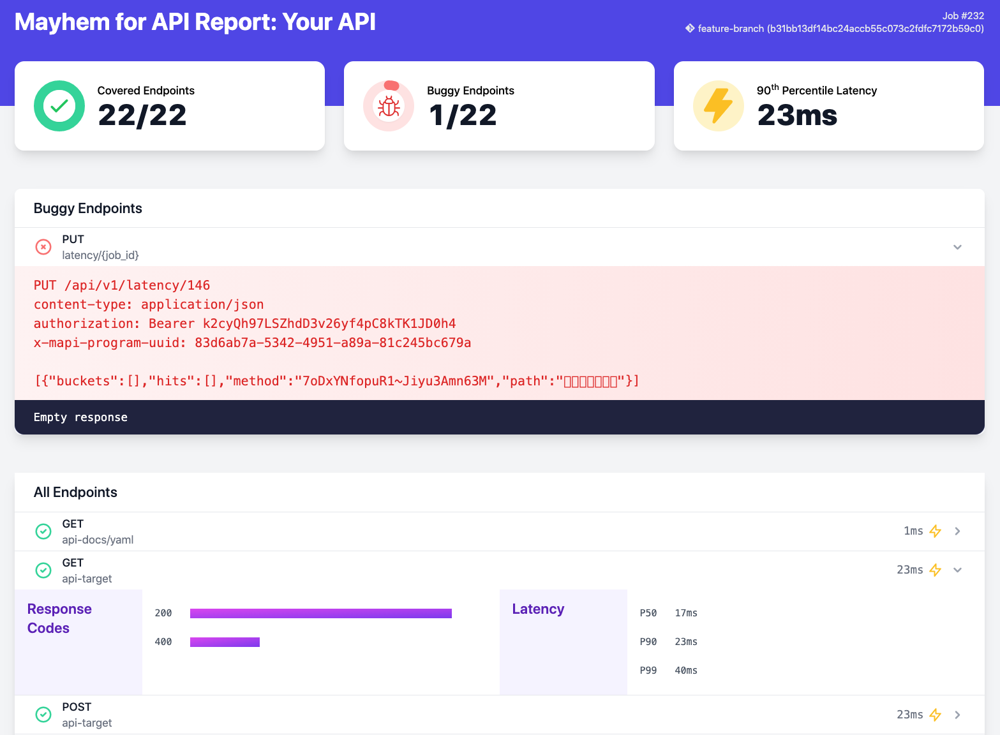

# Mayhem for API GitHub Action

[](https://www.mayhem.security/api-security)

A GitHub Action for using Mayhem for API to check for reliability,
performance and security issues in your APIs.

## About Mayhem for API

🧪 Modern App Testing: Mayhem for API is a dynamic testing tool that
catches reliability, performance and security bugs before they hit
production.

🧑‍💻 For Developers, by developers: The engineers building
software are the best equipped to fix bugs, including security bugs. As
engineers ourselves, we're building tools that we wish existed to make
our job easier!

🤖 Simple to Automate in CI: Tests belong in CI, running on every commit
and PRs. We make it easy, and provide results right in your PRs where
you want them. Adding Mayhem for API to a DevOps pipeline is easy.

Want to try it? [Sign up for free](https://www.mayhem.security/api-security) today!

## Usage

1. Get a Mayhem for API token

    a. [Sign up for Mayhem for free and install `mapi`](https://app.mayhem.security)

    b. Create an [API token](https://app.mayhem.security/docs/api-testing/getting-set-up/generating-api-tokens/)

    c. Add your API token with name `MAYHEM_TOKEN` on your repository's GitHub page at
       `Settings` → `Secrets` → `New repository secret`

2. Create a file in _your_ GitHub repository at:
```
    .github/workflows/ForAllSecure-Mayhem-for-API.yml
```

3. Add the following text to the file and tweak it for your codebase.

    **Note**: To auto-detect diffs, Mayhem needs a deeper repository clone than the default of actions/checkout@v3.  Set `fetch-depth` to 0 for a full clone, or deeper clones to fetch enough commit history to compute a merge base for the branch.

```yaml
name: Mayhem for API
on:
    push:
    pull_request:
jobs:
  security:
    runs-on: ubuntu-latest
    steps:
    - uses: actions/checkout@v3
      with:
        # fetch entire history to compute diffs between jobs
        fetch-depth: 0

    - name: Start your API
      run: ./run_your_api.sh & # <----------------------------------- UPDATE THIS

    - name: Run Mayhem for API to check for vulnerabilities
      uses: ForAllSecure/mapi-action@v2
      with:
        mayhem-token: ${{ secrets.MAYHEM_TOKEN }}
        api-url: http://localhost:8000 # <--------------------------- UPDATE THIS
        api-spec: your-openapi-spec-or-postman-collection.json # <--- UPDATE THIS
```

4. Commit the new file and push it up to GitHub

5. Your new Mayhem for API action will be visible at

    `https://github.com/<USERNAME>/<REPO_NAME>/actions`

---

This repo contains a [full example](workflow.yml) for reference.

The action accepts the follow inputs:

| Required | Input Name | Type | Description | Default
| --- | --- | --- | --- | ---
| ✔️ | `mayhem-token` | string | Mayhem API token |
| ✔️ | `api-url` | string | URL to your running API. *Example:* http://localhost:8000/api/v1 |
| ✔️ | `api-spec` | string | Path or URL to your Swagger spec, OpenAPI spec, or Postman collection file, or Postman [collection id](https://support.postman.com/hc/en-us/articles/5063785095319-How-to-find-the-ID-of-an-element-in-Postman).|
|   | `target` | string | The organization-scoped name of your target, such as `forallsecure/mapi-action-example` | auto-generated from your GitHub Repository name
|   | `postman-api-key` | string | Postman [API key](https://learning.postman.com/docs/developer/intro-api/) for api specs that are private postman collection ids.
|   | `postman-environment` | string | Path or id of a Postman [Environment](https://learning.postman.com/docs/sending-requests/managing-environments/).
|   | `zap-api-scan` | boolean | Include results from [ZAP - API Scan](https://www.zaproxy.org/docs/docker/api-scan/) | false |
|   | `duration` | number/string | Duration of scan. 'auto' for automatic duration. Otherwise time (ie: '30sec', '5min', '1h', '1h30m') | auto
|   | `html-report` | string | Path to the generated SARIF report |
|   | `sarif-report` | string | Path to the generated HTML report |
|   | `run-args` | string | Additional arguments to provide to the `mapi run` command.  Argument values should be separated on new lines. <br><br>e.g.<br> <pre>  run-args: \|<br>    # Basic Auth<br>    --basic-auth<br>    login:password</pre><br>⚠️ Avoid wrapping values in quotes, as these will be escaped and included in the value passed to `mapi`.<br><br>⛔️ `"login:password"` <br>✅ `login:password` |
|   | `mayhem-url` | string | Path to your Mayhem API instance.  If you're using something other than the default of https://app.mayhem.security |

### Continuing on error

The above examples will fail the workflow when issues are found. If you
want to ensure the Action continues, even if Mayhem for API found
issues, then continue-on-error can be used.

```yaml
name: Mayhem for API
on:
    push:
    pull_request:
jobs:
  security:
    runs-on: ubuntu-latest
    steps:
    - uses: actions/checkout@v3
      with:
        # fetch a greater number of commits for computing diffs between jobs
        fetch-depth: 50

    - name: Start your API
      run: ./run_your_api.sh &

    - name: Run Mayhem for API to check for vulnerabilities
      uses: ForAllSecure/mapi-action@v1
      continue-on-error: true # <-----------------------------------------------
      with:
        mayhem-token: ${{ secrets.MAYHEM_TOKEN }}
        api-url: http://localhost:8000 # <- update this
        api-spec: your-openapi-spec-or-postman-collection.json
        # Additional 'mapi run' arguments
        run-args: |
          # Basic Auth
          --basic-auth
          login:password
          # Do not fuzz the '/logout' endpoint
          --ignore-endpoint
          /logout
          # Treat all warnings as errors
          --warnaserror

```

# Reports

Mayhem for API generate reports when you pass `sarif-report` or
`html-report` to the input. Make sure to pass `continue-on-error` to the
Mayhem for API step if you want to process the reports in follow-up
steps.

## Artifact HTML Report



To create an artifact of the report in your build, add this step to your pipeline:

```yaml
- name: Run Mayhem for API to check for vulnerabilities
  uses: ForAllSecure/mapi-action@v1
  continue-on-error: true
  with:
    mayhem-token: ${{ secrets.MAYHEM_TOKEN }}
    api-url: http://localhost:8000 # <- update this
    api-spec: your-openapi-spec-or-postman-collection.json # <- update this
    html-report: mapi.html

# Archive HTML report
- name: Archive Mayhem for API report
  uses: actions/upload-artifact@v2
  with:
    name: mapi-report
    path: mapi.html
```

## GitHub Code Scanning support


Uploading SARIF reports to GitHub allows you to see any issue found by
Mayhem for API right on your PR, as well as in the "Security" tab of
your repository. This currently requires you to have a GitHub Enterprise
Plan or have a public repository. To upload the SARIF report, add this
step to your pipeline:

```yaml
- name: Run Mayhem for API to check for vulnerabilities
  uses: ForAllSecure/mapi-action@v1
  continue-on-error: true
  with:
    mayhem-token: ${{ secrets.MAYHEM_TOKEN }}
    api-url: http://localhost:8000 # <- update this
    api-spec: your-openapi-spec-or-postman-collection.json # <- update this
    sarif-report: mapi.sarif

# Upload SARIF file (only available on public repos or github enterprise)
- name: Upload SARIF file
  uses: github/codeql-action/upload-sarif@v1
  with:
    sarif_file: mapi.sarif
```

If your API server sends back stacktraces in the 500 Internal Server
Error (only do this in a test environment -- never in production!),
Mayhem for API will try to map issues it finds to the exact line of code
that triggered the issue.
